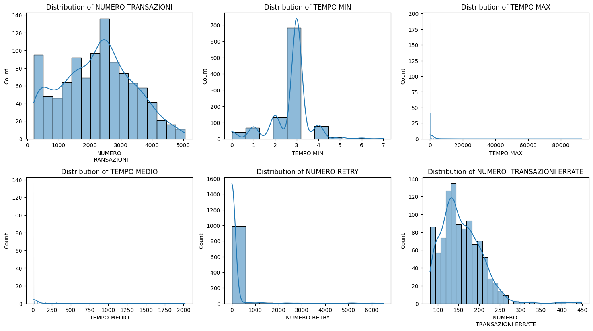

# **Reply Anomaly Detection Project**

## **Team Members**
- Tommaso Agudio, 792161  
- Michele Aversa, 800961  
- Nicolò Cappellini, 112233  

---

## **Introduction**

This project addresses forecasting and anomaly detection tasks. To increase data volume, augmentation played a crucial role. We used a Variational Autoencoder (VAE) to generate five additional days of data. The original dataset, provided by a betting site, contains minute-by-minute logs of working days, including the number of transactions and other important features.

---

## **Methods**

### **Overview**

The workflow includes the following main steps:

- **Data Augmentation**:  
  We used a Variational Autoencoder (VAE) for data augmentation. After experimenting with the loss function, we achieved a distribution similar to the original. However, we encountered two issues:
  - The `DATA ORA` column did not correctly reflect exact minutes.
  - After spending significant time adjusting the loss function without resolving the issue, we decided to hardcode the `DATA ORA` column. Although this may slightly affect distribution accuracy, it ensured correct time formatting.

To reduce noise, we generated five different days using the VAE and computed the mean of the `NUMERO TRANSAZIONI` feature across them.

- **Feature Selection**:  
  For forecasting, we used the following features:
  - **NUMERO TRANSAZIONI** – Total number of transactions  
  - **NUMERO TRANSAZIONI ERRATE** – Number of failed or incorrect transactions  
  - **NUMERO RETRY** – Number of retry attempts  
  - **TEMPO MAX** – Maximum processing time per transaction  

  These features were selected using a correlation matrix, ensuring minimal multicollinearity by picking features with low mutual correlation.

- **Modeling & Detecting Anomalies**:

  - **LSTM**:  
    We trained an LSTM model to forecast 15-minute intervals based on the previous 60 minutes of data. This design aimed to give the LSTM a temporal context specific to each part of the day. Forecasting based on the entire dataset could cause the model to miss localized trends and variations.

    

  - **5-Minute Moving Average Comparison**:  
    We replaced the original 15-minute window in a dataset copy with the LSTM forecast. Then we plotted actual vs. predicted values using a 5-minute rolling average over a 45-minute window. We chose this as our first approach since it allows visual anomaly detection by highlighting significant deviations and line crossings, indicating potential anomalies.

  - **Isolation Forest**:  
    We also applied an Isolation Forest to detect anomalies using the actual and forecasted 15-minute windows. Both were fed into the model, and predictions were plotted to highlight anomalies. We implemented also the isolation forest because we were interested also in visualizing the anomalies not only on the moving average but also on the actual data points. These were visually verified with side-by-side plots of original vs. predicted values.

- **Workflow Overview**:  
  The general workflow of the entire project is summarized in the following flowchart. The repository includes a `requirements.txt` file to install all dependencies:

    

---

## **Experimental Design**

We conducted multiple experiments, covering all aspects from data augmentation to anomaly detection:

- **Data Augmentation**:  
  Our first task chronologically was to augment the dataset. We tried two alternatives before settling on the VAE:

  - **Noising the Data**:  
    Initially, we duplicated the original day five times and added Gaussian noise. While this approach yielded slightly different but similar data, it didn't feel like genuine augmentation. The generated data had roughly 10% variation from the original. Despite visual similarity in distributions, we decided not to proceed with this method.

  - **GAN/TimeGAN**:  
    We experimented with both vanilla GANs and TimeGAN. The results were unsatisfactory: the vanilla GAN generated unrealistic data, and TimeGAN posed implementation challenges and poor output. We couldn't derive any useful results or metrics, and ultimately abandoned the GAN-based approaches.

- **Forecasting**:  
  Although we were advised not to use ARIMA/SARIMA, we experimented with them briefly. These models actually produced decent forecasts, especially over longer windows (20–30 minutes), capturing trends and spikes effectively. However, in accordance with project guidelines, we did not use them for our final model or baselines. We used RMSE and R² scores to evaluate their performance.

- **Anomaly Detection**:  
  We also tested an autoencoder for anomaly detection on forecasted and actual values. Unfortunately, performance was poor—either missing obvious anomalies or overflagging normal data. This was likely due to suboptimal architecture or hyperparameter settings.

---

## **Results**

The final results are quite satisfying. We invested significant time in data augmentation to ensure a solid foundation before forecasting and anomaly detection.

Here is the distribution comparison after VAE augmentation:

Despite early noisy outputs from the VAE, we managed to generate usable data that produced meaningful LSTM forecasts. While not perfect, the predictions were interpretable and effective for anomaly detection.

From the rolling average analysis, we observed that the LSTM tends to **underestimate** the number of transactions. Still, it successfully identified anomalies: for instance, two anomalies were detected in a 20-minute window.

The Isolation Forest model also performed well, detecting anomalies in both actual and forecasted data. In the same 15-minute window, we found four anomalies—two in the actual values and two in the forecasts.

Here are the corresponding plots:

---

## **Conclusion**

This project was both challenging and rewarding. We explored unfamiliar areas such as data augmentation and implemented complex techniques like LSTMs and VAEs. Our progress required extensive research and adaptation.

Although some ideas—like using GANs or AutoEncoders for anomaly detection—didn't pan out, we believe the final solution is robust and effective. It systematically addresses forecasting and anomaly detection with thoughtful modeling and meaningful visualizations.

there’s plenty of room for future improvements, such as:

- exploring alternative augmentation strategies to evaluate their impact on downstream performance  
- improve our autoencoder to better capture the initial distribution, so that we can feed multiple days to the lstm and get more accurate results  
- predict also other features like number of retry so that we can spot anomalies also based on that  
- since we lost the majority of our time trying in the augmentation process, we think that we could’ve tried to implement different solutions/models for our forecasting and anomaly detection  

---

