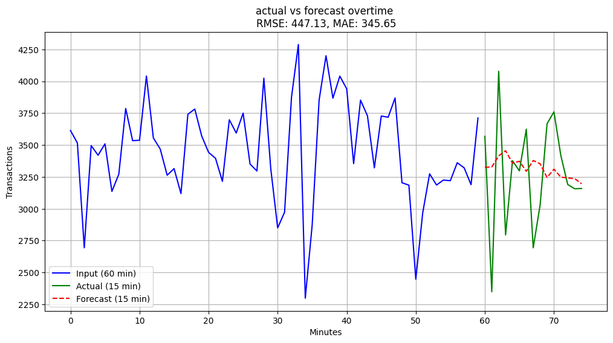
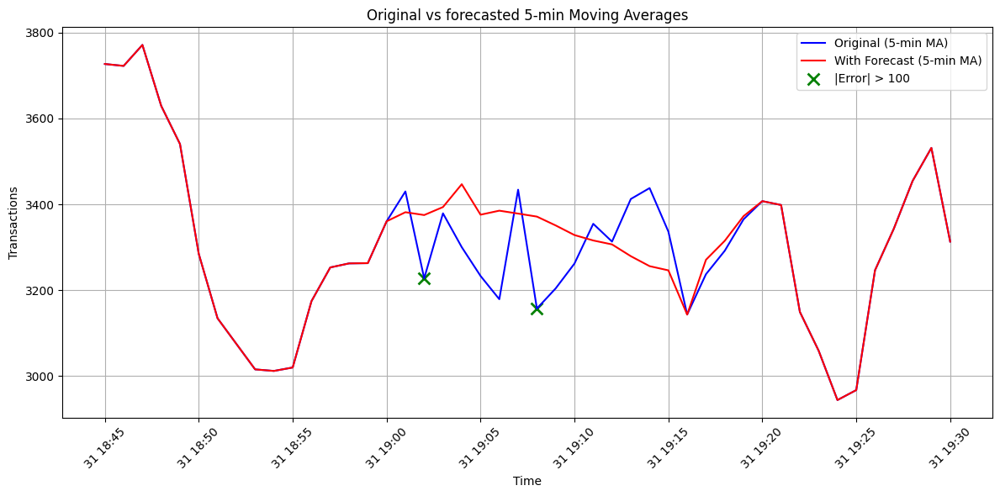
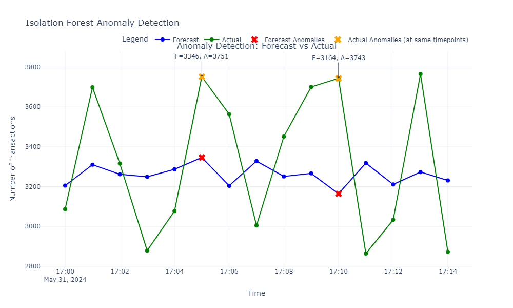
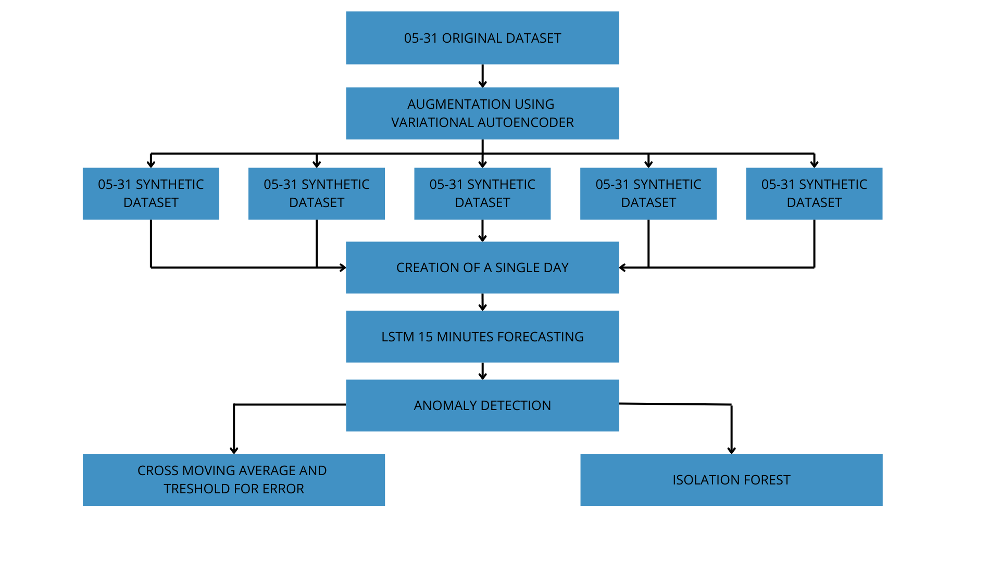

# **Reply anomaly detection project**

## **Team Members**
- Tommaso Agudio, 792161
- Michele Aversa, 800961
- Nicolò Cappellini, 112233

## **Introduction**

This project addresses a forecasting and anomaly detection tasks. In order to have more data the part of augmentation plays a crucial role, and it was done using VAE to get other 5 days worth of data. The original dataset we were given is a dataset of a betting site, where we have minute by minute the working day, with number of transactions and other important features. 

---

## **Methods**

### **Overview**

The workflow includes the following main steps:

- **Data Agumentation**: We have done data agumentation using VAE in order to get more data to work with. 

- **Feature Selection**: For our forecasts we used the following features: 
    - **NUMERO TRANSAZIONI** – Total number of transactions.
    - **NUMERO TRANSAZIONI ERRATE** – Number of failed or incorrect transactions.
    - **NUMERO RETRY** – Number of retry attempts made.
    - **TEMPO MAX** – Maximum time taken (possibly per transaction).

We chose those features through the correlation matrix, taking the ones that had the lower correaltion between each other, avoiding multicollinearity. 

- **Modeling & Detecting Anomalies**:

  - LSTM: We used LSTM in order to forecast a window of 15 minutes using a window of 60 earlier minutes as input data. By doing so we thought that could give the LSTM a "memory" of the behaviour of the "Number of Transactions" in that given window of the day. For instance, if we trained out LSTM on the whole dataset and then forecasted a 15 minutes, the risk was that the LSTM wasn't catching the trend in that specific moment of the day. 

         

  - Crossing 5 minutes moving average: We took the LSTM predictions and replaced the original 15 minutes timeframe in a copy of the dataset. Then we created a plot of "Actual VS Forecasted" for a window of 45 minutes with the 5 minutes rolling averages. Doing so gave us a plot where we could see how the forecast behave in comparison to the orginal data. Also, this is a common technique do identify anomalies in the forecasted values. For instance, we have an anomaly in the forecast when it is above the original data or crosses the original data. For example, we got in a timeframe the following plot:

    

  - Isolation Forest: We also used an isolation forest in order to lookg for anomalies in the forecasted 15 minutes values, instead of the moving average. Here we simply took the original timeframe and the forecasted timeframe, gave both of them to the isolation forest to fit it and predict, then plotted the results. In the plot we have both the actual and the forecasted values with the anomalies highlighted:

    

- **Workflow**: The general workflow of the entire project can be easily understoond from this flowchart. Also, in the repository can be found a "requirements.txt" that will install all the required dependencies: 

    

## **Experimental design**

In order to achieve these results we went through some experiments, that emcopasses everything, from the data agumentation to the anomaly detection.
- Data Agumentation: Our first task in cronological order was to augment the data, and here we tried 2 different ways before using the VAE:

    - Noising the data: Our first try was to just duplicated the day that we were given in the original dataset for 5 times, and add some noise to the duplicated day. Doing so of course gave us some "noisy data" that was different from the original, but pretty accurate. But we decided to not use this method because it felt like if we were not doing real data augmentation, but just duplicated the days of the dataset. 

    - GAN/TimeGAN: We then tried also using GAN, and this was a rough time. First of all we tried using a vanilla GAN, but not only the results were really bad, but also the creationg of the code needed was pretty hard. We then tried with a TimeGAN, trying to also catch the time dependecies, but here the same problems of the GAN arise, so we just decided to drop the GAN path. 

- Forecasting: even if we were told to not use ARIMA or SARIMA for the purposes of the project, we still tried to use them in order to get the predictions. It is needless to say that the forecasts were pretty accurate, catching a lot of the spikes of the original data, especially when forecasting larger time windows (like 20/30 minutes). But since we were asked to not use them we just dropped them, and also we didn't use them as a baseline.

- Anomaly detection: For anomaly detection we just tried to use also an AutoEncoder in order to catch anomalies in the forecasts and actual values. Probably, due to either the poor performances or our fault in tuning the hyperparameters, the autoencoder performed really bad. It was basically either not catching anomalies at all (even when it was visible that an anomaly was there) or catching a TON of anomalies (even the ones that were just normal datapoints).

